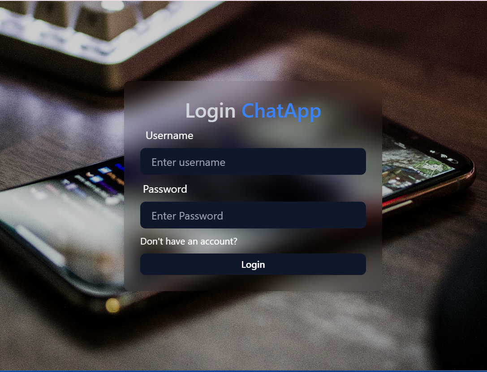
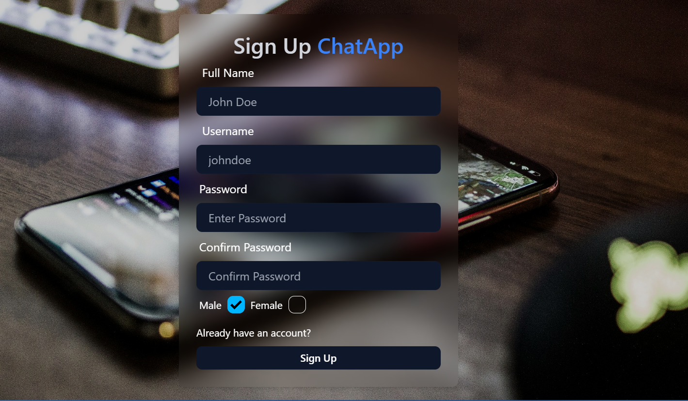
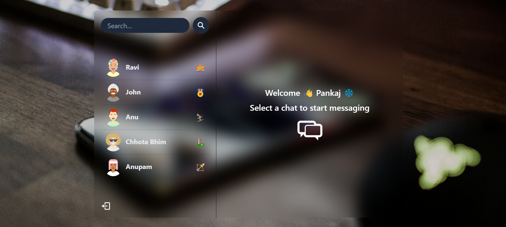
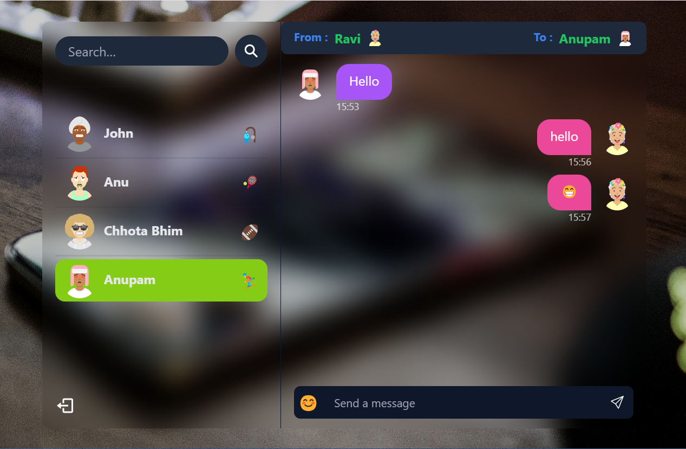

# MERN Stack Project: Build and Deploy a Real Time Chat App | JWT, Socket.io

Built And Deployed on Render.com
# [Deployment Link](https://chit-chat-app-aoy3.onrender.com/)






Some Features:

-   🌟 Tech stack: MERN + Socket.io + TailwindCSS
-   🎃 Authentication && Authorization with JWT
-   👾 Real-time messaging with Socket.io
-   🚀 Online user status (Socket.io and React Context)
-   👌 Global state management with Zustand
-   🐞 Error handling both on the server and on the client
-   ⭐ At the end Deployment like a pro for FREE!
-   ⏳ And much more!

### Create a .env file in the root directory of the project and add the following:

### Setup .env file

```js
PORT=...             # Port number where the server will run
MONGO_DB_URI=...     # MongoDB connection string
JWT_SECRET=...       # Secret key for JWT
NODE_ENV=...         # Set to 'development' or 'production'
```

### Installation

1. Clone the repository:

```js
git clone <repository-url>
cd <repository-folder>
```

2. Install dependencies:

3. npm install

4. Set up the .env file as described above.

5. Start MongoDB server.

### Build the application

```shell
npm run build
```

### Start the application

```shell
npm start
```
